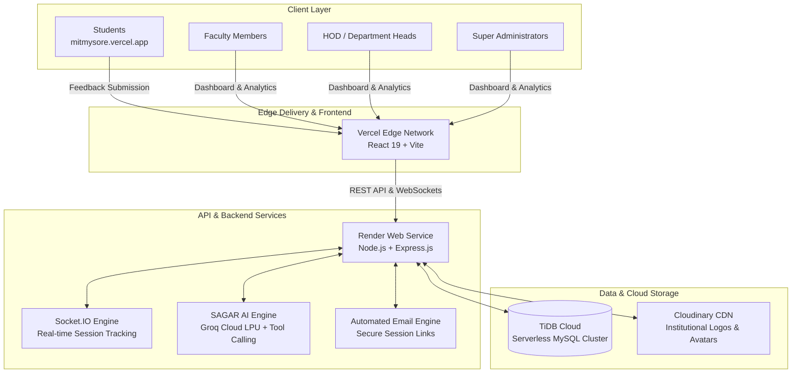

# 🎓 MIT Mysore — Student Feedback & Academic Intelligence Platform

<div align="center">

[](https://mitmysore.vercel.app)
[](https://react.dev/)
[](https://nodejs.org/)
[](https://tidbcloud.com)
[-8b5cf6?style=for-the-badge&logo=openai&logoColor=white)](https://groq.com)
[](LICENSE)

**A secure, full-stack, enterprise-grade academic feedback and performance analytics ecosystem built for Maharaja Institute of Technology Mysore.**

[Explore Live Web App](https://mitmysore.vercel.app) · [Report Bug](https://github.com/Suhassagar/feedback-mitmysore/issues) · [Request Feature](https://github.com/Suhassagar/feedback-mitmysore/issues)

</div>

---

## 📑 Table of Contents

- [Overview](#-overview)
- [🤖 SAGAR AI — Intelligent Academic Copilot](#-sagar-ai--intelligent-academic-copilot)
- [System Architecture](#️-system-architecture)
- [Key Features by Persona](#-key-features-by-persona)
  - [Students](#-students)
  - [Faculty](#-faculty)
  - [Department Heads (HOD)](#️-department-heads-hod)
  - [Institutional Administrators](#-institutional-administrators)
- [Technology Stack](#️-technology-stack)
- [Getting Started (Local Setup)](#-getting-started-local-setup)
- [Environment Configuration & Security](#-environment-configuration--security)
- [Project Structure](#-project-structure)
- [Security & Privacy Architecture](#-security--privacy-architecture)
- [License & Maintainer](#-license--maintainer)

---

## 📖 Overview

The **MIT Mysore Feedback Management System** is a next-generation feedback and academic intelligence platform engineered to modernize institutional feedback loops, eliminate paperwork, guarantee complete student anonymity, and deliver actionable performance metrics to department leadership and educators in real time.

Built on a cloud-native, high-throughput architecture, the system incorporates:
- **WebSocket Synchronization**: Live USN-level submission tracking without exposing vote secrecy.
- **Connection-Pooled Storage**: High-concurrency feedback ingestion powered by Knex.js on TiDB Cloud Serverless MySQL.
- **SAGAR AI Copilot**: An autonomous, conversational AI assistant that turns feedback data into immediate pedagogical actions.
- **Mobile-First Responsive Interface**: Polished UI designed for desktop workstations and smartphones alike (down to 360px viewports).

---

## 🤖 SAGAR AI — Intelligent Academic Copilot

**SAGAR AI** (*Smart Academic Guidance & Analytics Resource*) is the platform's embedded conversational copilot and administrative assistant. Developed using ultra-low-latency inference via **Groq Cloud LPUs** and state-of-the-art LLMs, SAGAR AI bridges the gap between raw feedback metrics and institutional decision-making.

### 🌟 Core Capabilities of SAGAR AI

| Capability | Description |
| :--- | :--- |
| 🧭 **Autonomous Dashboard Navigation** | Understands natural language requests and navigates the HOD directly to target pages (e.g., *"Take me to student management"* or *"Open department settings"*). |
| 📊 **Generative Visual Analytics** | Translates analytical questions into interactive charts rendered directly inside the chat UI (e.g., *"Show me performance trends for Semester 5"*). |
| ⚡ **Intelligent Session Orchestration** | Validates criteria and opens or creates new feedback sessions with pre-filled semester, section, and timing parameters through conversational cards. |
| 👨‍🏫 **Faculty Profiling & Approvals** | Searches faculty members by name or ID, inspects their teaching evaluations, surfaces top performers, and allows one-click approvals of pending faculty registrations. |
| 📝 **Executive Remarks & Sentiment Synthesis** | Ingests thousands of open-ended, anonymous student comments and synthesizes them into key strengths, constructive criticism, and recommended faculty mentoring steps. |
| 📥 **Instant Report Generation** | Compiles department-wide feedback summaries and triggers immediate accredited CSV downloads on demand. |

### 🛡️ Privacy & Guardrails in SAGAR AI
- **Role-Gated Access**: Accessible exclusively by authenticated department heads and academic leaders.
- **Zero Exposure of Student Identity**: Because feedback is decoupled at ingestion time, student identities, USNs, and credentials are mathematically excluded from the model context.
- **Human-in-the-Loop Safeguards**: Destructive or mutative actions (creating sessions, adding courses, approving faculty) require explicit confirmation dialogs before execution.

---

## 🏛️ System Architecture



---

## ✨ Key Features by Persona

### 🎓 Students
- **Zero-Friction Access**: Clean, mobile-optimized interface accessible via USN and temporary session tokens.
- **100% Anonymity**: Feedback ratings and comments are strictly decoupled from student records to ensure unbiased reporting.
- **Dynamic Rating Matrix**: Evaluation criteria organized across clear sections with touch-friendly 1–5 rating scales and optional anonymous remarks.

### 👨‍🏫 Faculty
- **Personal Analytics Hub**: Comprehensive dashboards showing cumulative ratings, feedback counts, and subject-wise averages.
- **Performance Breakdown**: Individual question metrics covering teaching clarity, syllabus pacing, subject expertise, and student engagement.
- **Accreditation Readiness**: One-click generation of performance records formatted for NAAC and NBA documentation.

### 🏛️ Department Heads (HOD)
- **Session Orchestration**: Instant creation of feedback sessions with auto-generated session keys and automated email dispatch to students.
- **Live Submission Monitoring**: Real-time USN status tracking (Completed vs. Pending) without compromising individual response secrecy.
- **Roster Management**: Single-entry and bulk Excel/CSV import for students, faculty, and course offerings.
- **SAGAR AI Assistant**: Immediate summarization of student feedback and automated departmental performance reporting.

### 🛡️ Institutional Administrators
- **Cross-Department Oversight**: Global benchmarking of engineering departments (CSE, ISE, AIML, AIDS, ECE, ME, CV, etc.).
- **Immutable Security Audit Trail**: Timestamped logging of administrative events, data purges, logins, and session lifecycles.
- **Granular Role-Based Access Control**: Cookie-based session authentication protected with strict SameSite policies and bcrypt password hashing.

---

## 🛠️ Technology Stack

| Layer | Technologies | Purpose |
| :--- | :--- | :--- |
| **Frontend** | React 19, Vite, React Router v6 | High-performance SPA with client-side routing |
| **Styling** | Vanilla CSS Design System | Responsive grid, glassmorphism, mobile-optimized typography |
| **Data Visualization** | Recharts | Interactive bar, area, and radar performance charts |
| **Backend API** | Node.js, Express.js | REST API, security middleware, and session management |
| **Real-time Engine** | Socket.IO | Live feedback progress broadcast to department dashboards |
| **Database** | TiDB Cloud (Serverless MySQL 8.0) | High-availability relational database with Knex.js pooling |
| **Artificial Intelligence** | SAGAR AI (Groq Cloud SDK) | Function calling, real-time analytics, and text synthesis |
| **Email Dispatch** | Nodemailer (Gmail SMTP) | Automated, branded student session invitation emails |
| **Media Delivery** | Cloudinary CDN | Scalable profile avatars and institutional graphics |
| **Deployment** | Vercel (Frontend), Render (Backend) | Globally distributed edge hosting and auto-scaling APIs |

---

## 🚀 Getting Started (Local Setup)

### Prerequisites
- [Node.js](https://nodejs.org/) (v18 or higher recommended)
- [npm](https://www.npmjs.com/) or [yarn](https://yarnpkg.com/)
- MySQL database instance (or a free [TiDB Cloud](https://tidbcloud.com) serverless cluster)

---

### 1. Clone the Repository
```bash
git clone https://github.com/Suhassagar/feedback-mitmysore.git
cd feedback-mitmysore
```

### 2. Configure & Run Backend
```bash
cd backend
npm install
```

Create a `.env` file in the `backend/` directory based on [`backend/.env.example`](backend/.env.example):
```env
PORT=8081
NODE_ENV=development
DB_HOST=127.0.0.1
DB_PORT=3306
DB_USER=root
DB_PASSWORD=your_local_db_password
DB_NAME=college_feedback_system
DB_SSL=false
SESSION_SECRET=your_random_session_secret_key
FRONTEND_URL=http://localhost:5173
EMAIL_USER=your_email@gmail.com
EMAIL_PASS=your_gmail_app_password
GROQ_API_KEY=your_groq_api_key_here
```

Start the backend server:
```bash
npm run dev
# Backend API listening on http://localhost:8081
```

### 3. Configure & Run Frontend
In a new terminal window:
```bash
cd frontend
npm install
```

Create a `.env` file in the `frontend/` directory based on [`frontend/.env.example`](frontend/.env.example):
```env
VITE_API_URL=http://localhost:8081
```

Start the frontend application:
```bash
npm run dev
# Frontend accessible at http://localhost:5173
```

---

## 🔒 Environment Configuration & Security

> [!CAUTION]
> **Never commit `.env` files to public or private version control.** All sensitive keys, passwords, and tokens must reside solely in environment variables on your deployment platform (Vercel, Render, AWS, etc.).

| Environment Variable | Description | Safe Example / Default |
| :--- | :--- | :--- |
| `PORT` | Port number for Express backend | `8081` |
| `NODE_ENV` | Environment runtime mode | `development` or `production` |
| `DB_HOST` | Database server address | `127.0.0.1` or cloud host |
| `DB_PORT` | MySQL connection port | `3306` (or `4000` for TiDB) |
| `DB_USER` | Database username | `root` or cluster username |
| `DB_PASSWORD` | Database password | `<your_db_password>` |
| `DB_NAME` | Relational database schema name | `college_feedback_system` |
| `DB_SSL` | Enable SSL encryption for cloud databases | `false` locally, `true` in cloud |
| `SESSION_SECRET` | Cryptographic key for session cookies | 64+ char random hex string |
| `FRONTEND_URL` | Allowed CORS origin and callback host | `http://localhost:5173` or live domain |
| `EMAIL_USER` | Notification sender email address | Institutional Gmail account |
| `EMAIL_PASS` | Google 16-digit App Password | Generated in Google Account Security |
| `GROQ_API_KEY` | Groq Cloud API key for SAGAR AI | `gsk_...` from console.groq.com |
| `CLOUDINARY_*` | Cloudinary credentials for media assets | Optional cloud credentials |

---

## 📂 Project Structure

```text
college_feedback_system/
├── backend/                       # Express.js REST API & WebSocket Server
│   ├── config/                    # Knex DB connection pool & Zod env validation
│   ├── controllers/               # Business logic (Auth, Sessions, Feedback, SAGAR AI)
│   ├── middleware/                # Rate limiters, error handling, session guards
│   ├── routes/                    # API route declarations
│   ├── utils/                     # Email dispatch & AI helper functions
│   ├── .env.example               # Sanitized backend environment template
│   └── server.js                  # Application entry point & Socket.IO server
├── frontend/                      # React 19 Frontend (Vite)
│   ├── src/
│   │   ├── components/            # Reusable UI components, Modals & SAGAR Copilot
│   │   ├── context/               # AuthContext & global state providers
│   │   ├── features/              # Feature modules (Faculty, Admin, Student)
│   │   ├── hooks/                 # Custom React hooks (useDepartmentName, useSessions)
│   │   ├── pages/                 # Responsive route views & dashboards
│   │   ├── services/              # Axios apiClient & WebSocket listeners
│   │   ├── utilities.css          # Design system, modal rules & responsive utilities
│   │   └── theme.css              # Theme tokens & institutional palette
│   ├── .env.example               # Sanitized frontend environment template
│   └── vite.config.js             # Vite build configuration
├── production_database_setup.sql  # Database schema & sample seed data
├── README.md                      # Comprehensive project documentation
├── CONTRIBUTING.md                # Community contribution guidelines
├── SECURITY.md                    # Vulnerability reporting protocol
└── LICENSE                        # MIT License
```

---

## 🛡️ Security & Privacy Architecture

- **Response Confidentiality**: Student USNs are used solely for session eligibility verification; individual feedback ratings and comments are mathematically unlinked upon submission.
- **Encrypted Session Cookies**: Authenticated sessions utilize HTTP-only, SameSite-strict cookies to mitigate XSS and CSRF exposure.
- **SQL Injection Defense**: All database queries are executed through Knex parameterization and prepared statements.
- **Immutable Audit Logging**: Key institutional events (user logins, roster updates, session creation, data purges) are permanently recorded with client IP and user-agent metadata.
- **Rate Limiting Protection**: Configured via Express-Rate-Limit on authentication and feedback submission endpoints to prevent brute-force attacks.

---

## 📜 License

Distributed under the **MIT License**. See the [`LICENSE`](LICENSE) file for complete details.

---

## 👨‍💻 Author & Maintainer

**Suhas Sagar**  
Maharaja Institute of Technology Mysore  
- 🐙 GitHub: [@Suhassagar](https://github.com/Suhassagar)  
- 🌐 Web: [mitmysore.vercel.app](https://mitmysore.vercel.app)
